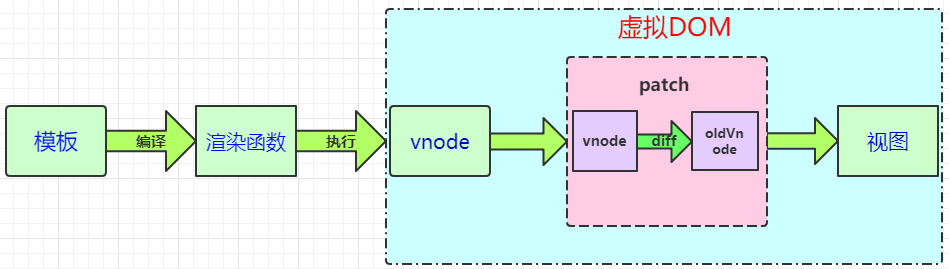

### Vue Virtual DOM

(揭秘Vue中的Virtual Dom)[https://github.com/ljianshu/Blog/issues/69]

### 模板转换成视图的过程

    在Vue中将模板 template 转换成 视图的过程

      * Vue.js 通过编译将 template 模板转成 render() 渲染函数，
        执行render() 渲染函数就能得到一个虚拟节点树（VNode）

      * 在对Model（数据层）进行操作的时候，会触发对应Dep（订阅者）中的watcher对象（观察者）
        watcher会调用对应的 update 来修改视图。这个过程主要是将新旧的虚拟节点进行差异对比，
        然后根据对比结果进行DOM操作更新视图。

   

    